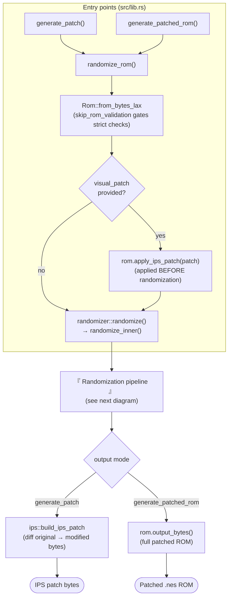
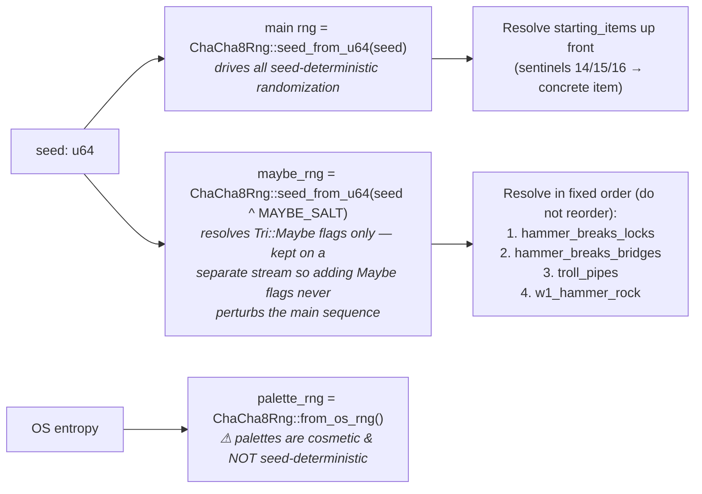

# SMB3-RS Application Flow

This document is a comprehensive map of how a randomized ROM is produced: the
entry points, the RNG streams, and **every** randomization step / patch in the
exact order `randomize_inner` applies them. Each step is annotated with the
`Options` field that gates it (steps with no gate are **always** applied).

Source of truth: `src/lib.rs` (entry points) and `src/randomizer.rs`
(`randomize_inner`, lines ~750–1093). Keep this diagram in sync when the
orchestration order changes.

## Top-level entry & output

## RNG streams (determinism contract)

## Randomization pipeline (`randomize_inner`, in order)

Legend: **[always]** = unconditional · **[opt]** = gated by the named option ·
`tag` = `rom.set_tag(...)` label used in the diff/spoiler.

```mermaid
flowchart TD
    START(["randomize_inner start"]) --> PRE

    subgraph PRE["0 · Pre-resolve (consume RNG up front)"]
        PRE1["resolve starting_items (main rng)"]
        PRE2["resolve Maybe tri-flags (maybe_rng):<br/>hammer_breaks_locks · hammer_breaks_bridges<br/>troll_pipes · w1_hammer_rock"]
        PRE1 --> PRE2
    end

    PRE --> MAP

    subgraph MAP["1 · QoL map patches FIRST (so overworld sees final connectivity)"]
        direction TB
        Q1["[always] qol::fix_w3_drawbridges  · tag qol/drawbridges"]
        Q2{"remove_rocks?"}
        Q2y["qol::remove_rocks  · tag qol/rocks"]
        Q3{"w1_hammer_rock<br/>(resolved)?"}
        Q3y["qol::make_w1_hammer_rock  · tag qol/w1_hammer_rock"]
        Q4["[always] qol::fix_big_q_block_rooms  · tag qol/big_q_blocks"]
        Q1 --> Q2
        Q2 -- yes --> Q2y --> Q3
        Q2 -- no --> Q3
        Q3 -- yes --> Q3y --> Q4
        Q3 -- no --> Q4
    end

    MAP --> DATA

    subgraph DATA["2 · Level-data prep & content randomization"]
        direction TB
        D1{"disable_autoscroll?"}
        D1y["autoscroll::disable_autoscroll  · tag autoscroll<br/><i>writes pre-baked airship level data; must precede powerups/builder</i>"]
        D2{"include_beta_stages?"}
        D2y["qol::fix_beta_stages  · tag qol/beta_stages<br/><i>reshape beta level cmds before powerup/enemy passes</i>"]
        D3{"powerups?"}
        D3y["powerups::randomize (main rng, +hammer_vuln flag)  · tag powerups"]
        D4{"palettes?"}
        D4y["palettes::randomize / randomize_themed<br/>(palette_themed picks variant) · ⚠ OS rng · tag palettes"]
        D5{"any_enemies_active?"}
        D5y["enemies::randomize (per-class Off/Shuffle/Wild + wild_injections) · tag enemies"]
        D6["[always] bowser_castle::randomize"]
        D7["[always] podoboo_gauntlet::randomize"]
        D8{"world_order?"}
        D8y["world_order::randomize(world_count)  · tag world_order"]
        D9{"big_q_blocks?"}
        D9y["enemies::randomize_big_q_blocks  · tag enemies/big_q_blocks"]
        D10{"shuffle_airships?"}
        D10y["levels::randomize_airships  · tag levels/airships"]
        D1 -- yes --> D1y --> D2
        D1 -- no --> D2
        D2 -- yes --> D2y --> D3
        D2 -- no --> D3
        D3 -- yes --> D3y --> D4
        D3 -- no --> D4
        D4 -- yes --> D4y --> D5
        D4 -- no --> D5
        D5 -- yes --> D5y --> D6
        D5 -- no --> D6
        D6 --> D7 --> D8
        D8 -- yes --> D8y --> D9
        D8 -- no --> D9
        D9 -- yes --> D9y --> D10
        D9 -- no --> D10
        D10 -- yes --> D10y --> KOOP
        D10 -- no --> KOOP
    end

    subgraph KOOP["3 · Koopaling stability & behavior"]
        direction TB
        K0{"koopalings_may_travel?<br/>(shuffle_airships ∨ hammer_vulnerable ∨ random_koopalings)"}
        K0y["fix_koopaling_softlock · koopaling_collision_guard<br/>koopaling_vram_clear · koopaling_y_clamp<br/>tags koopalings/*"]
        K1{"hammer_vulnerable_koopalings?"}
        K1y["koopalings::hammer_vulnerable_koopalings  · tag koopalings/hammer_vulnerable"]
        K2{"random_koopalings?"}
        K2y["koopalings::random_koopalings (main rng)  · tag koopalings/random_identity"]
        K0 -- yes --> K0y --> K1
        K0 -- no --> K1
        K1 -- yes --> K1y --> K2
        K1 -- no --> K2
        K2 -- yes --> K2y --> OW
        K2 -- no --> OW
    end

    subgraph OW["4 · Overworld builder pipeline (tag overworld/builder)"]
        direction TB
        OW1["node_catalog::build(include_beta_stages)<br/><i>Phase 1: classify 340 pointer entries</i>"]
        OW2{"swap_start_airship?"}
        OW2y["start_airship_swap::pick_swaps (main rng)"]
        OW3["overworld_pickup::pick_up<br/>{shuffle_spade_games, shuffle_toad_houses}<br/><i>Phase 2: clear map, build pools</i>"]
        OW4["overworld_build::build(rng, shuffle_toad_houses)<br/><i>Phase 3: assign levels, locks, pipes, HBs</i>"]
        OW5{"hands_levels?"}
        OW5y["hands_levels::mark_hand_traps (build) + install_full_grab (rom) · tag hands_levels"]
        OW6{"troll_pipes<br/>(resolved)?"}
        OW6y["troll_pipes::mark_troll_pipes (build)  · tag troll_pipes"]
        OWC["★ OVERWORLD CAPTURE POINT (clone BuildResult for analyzers)"]
        OW7["overworld_writer::write_overworld<br/><i>Phase 4: single-pass ROM write</i>"]
        OW1 --> OW2
        OW2 -- yes --> OW2y --> OW3
        OW2 -- no --> OW3
        OW3 --> OW4 --> OW5
        OW5 -- yes --> OW5y --> OW6
        OW5 -- no --> OW6
        OW6 -- yes --> OW6y --> OWC
        OW6 -- no --> OWC
        OWC --> OW7
    end

    DATA --> KOOP
    KOOP --> OW
    OW --> POST

    subgraph POST["5 · Post-build patches (items, metatiles, cosmetics, QoL)"]
        direction TB
        PO0["[always] hand_rooms::patch_clone_hand_rooms  · tag hand_rooms"]
        PO1{"chest_items?"}
        PO1y["items::randomize(remove_whistles)  · tag items"]
        PO1n{"remove_whistles?"}
        PO1ny["items::remove_whistles_only  · tag items/whistles"]
        PO2["[always] qol::set_starting_lives  · tag qol/starting_lives"]
        PO3{"airship_lock?"}
        PO3y["write 0x1FABC = A9 01 EA (anchor always-on) +<br/>items::write_mystery_anchor · tags airship_lock, items/mystery_anchor"]
        PO4["[always] patch_double_digit_metatiles  · tag metatile/double_digit"]
        PO5["[always] patch_metatile_6a_freeze  · tag metatile/6a_freeze"]
        PO6["[always] king_quotes::randomize (main rng)  · tag king_quotes"]
        PO7{"anchor_visuals?"}
        PO7y["anchor_visuals::apply  · tag anchor_visuals"]
        PO0 --> PO1
        PO1 -- yes --> PO1y --> PO2
        PO1 -- no --> PO1n
        PO1n -- yes --> PO1ny --> PO2
        PO1n -- no --> PO2
        PO2 --> PO3
        PO3 -- yes --> PO3y --> PO4
        PO3 -- no --> PO4
        PO4 --> PO5 --> PO6 --> PO7
        PO7 -- yes --> PO7y --> QOL
        PO7 -- no --> QOL
    end

    subgraph QOL["6 · Optional QoL / MaCobra52 toggles"]
        direction TB
        C1{"skip_wand_cutscene?"} -- yes --> C1y["koopalings::skip_wand_cutscene"]
        C2{"remove_n_cards?"} -- yes --> C2y["qol::remove_n_cards"]
        C3{"shuffle_spade_games?"} -- yes --> C3y["qol::fix_canoe_softlock"]
        C4{"adjust_boss_hitboxes?"} -- yes --> C4y["koopalings::adjust_boss_hitboxes"]
        C5{"koopaling_hits?"} -- yes --> C5y["koopalings::randomize_koopaling_hits (main rng)"]
        C6{"hammer_breaks_locks ∨ bridges?"} -- yes --> C6y["qol::hammer_breaks_tiles(locks, bridges)"]
        C7{"early_sun?"} -- yes --> C7y["qol::apply_early_sun"]
        C8{"japanese_damage?"} -- yes --> C8y["qol::apply_japanese_damage"]
        C9{"infinite_mushroom_houses?"} -- yes --> C9y["qol::apply_infinite_mushroom_houses"]
        C10{"fast_mushroom_house?"} -- yes --> C10y["qol::apply_fast_mushroom_house"]
        C11{"faster_tail_speed?"} -- yes --> C11y["qol::apply_faster_tail_speed"]
        C12{"no_game_over_penalty?"} -- yes --> C12y["qol::apply_no_game_over_penalty"]
        C13{"card_speed_clear?"} -- yes --> C13y["qol::card_speed_clear"]
        C1 --> C2 --> C3 --> C4 --> C5 --> C6 --> C7 --> C8 --> C9 --> C10 --> C11 --> C12 --> C13
        C1y -.-> C2
        C2y -.-> C3
        C3y -.-> C4
        C4y -.-> C5
        C5y -.-> C6
        C6y -.-> C7
        C7y -.-> C8
        C8y -.-> C9
        C9y -.-> C10
        C10y -.-> C11
        C11y -.-> C12
        C12y -.-> C13
    end

    POST --> QOL
    QOL --> FINAL

    subgraph FINAL["7 · Title screen, starting items, always-on patches, stamp"]
        direction TB
        F1{"!skip_rom_validation?"}
        F1y["title_screen::write_seed_hash(seed, options)<br/><i>hooks STA $0736 @ 0x308E2; assumes vanilla offsets</i> · tag title_screen"]
        F2{"starting_items<br/>non-empty?"}
        F2y["qol::write_starting_items (trampoline; runs AFTER title_screen,<br/>preserves intro-skip hook) · tag qol/starting_items"]
        F3["[always] qol::apply_macobra_patches  · tag qol/macobra"]
        F4{"faster_frog?"}
        F4y["qol::apply_faster_frog (MUST follow macobra patches) · tag qol/faster_frog"]
        F5["[always] stamp flag-key + seed @ STAMP_OFFSET 0x19DF0 (24 bytes) · tag stamp"]
        F1 -- yes --> F1y --> F2
        F1 -- no --> F2
        F2 -- yes --> F2y --> F3
        F2 -- no --> F3
        F3 --> F4
        F4 -- yes --> F4y --> F5
        F4 -- no --> F5
    end

    FINAL --> DONE(["return → diff/output in lib.rs"])
```

## Key ordering constraints (why the sequence is what it is)

- **QoL map patches run first** so the overworld builder sees final map
  connectivity and stores correct replacement tiles.
- **Autoscroll before powerups & builder**: it writes pre-baked airship level
  data and airship pointer redirects at vanilla offsets; the builder's
  `resort_pointer_table()` rearranges entries afterward.
- **Beta-stage fixes before powerups/enemies** so those passes see patched bytes.
- **Airship shuffle after autoscroll, before the builder** (same resort reason).
- **Koopaling stability patches** only when a Koopaling may load in a non-native
  world (`shuffle_airships ∨ hammer_vulnerable ∨ random_koopalings`).
- **Overworld capture point** sits after hands/troll mutations but before the
  writer, so analyzer snapshots match the player-visible topology.
- **`hand_rooms` before `items::randomize`** so cloned Hand treasure-room streams
  exist when chests roll.
- **`title_screen` before `starting_items`**: both touch the lives-init region
  at 0x308E0; the starting-items trampoline incorporates the intro-skip hook.
- **`faster_frog` after `apply_macobra_patches`**: two of its writes patch inside
  the always-on tail-swim routine macobra writes unconditionally.
- **Palettes use OS entropy**, not the seed — cosmetic and intentionally not
  reproducible from the seed / flag key.
