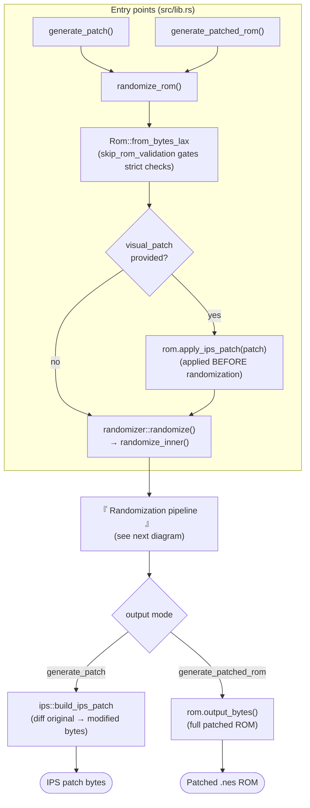
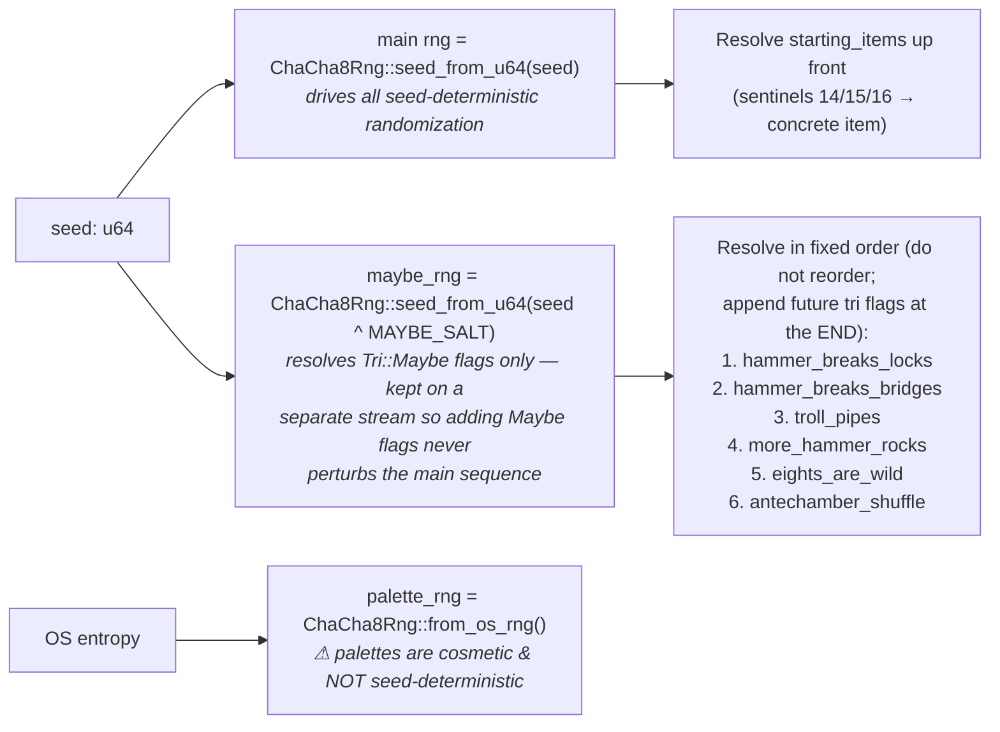

# SMB3-RS Application Flow

This document is a comprehensive map of how a randomized ROM is produced: the
entry points, the RNG streams, and **every** randomization step / patch in the
exact order `randomize_inner` applies them. Each step is annotated with the
`Options` field that gates it (steps with no gate are **always** applied).

Source of truth: `src/lib.rs` (entry points) and `src/randomizer/mod.rs`
(`randomize_inner`). Keep this in sync when the orchestration order changes —
and if you find it out of sync, regenerate the whole pipeline section from the
function rather than patching a line, which is how it fell twenty steps behind
once already. Last reconciled against the code: **2026-09-08**.

## Top-level entry & output

```mermaid
flowchart TD
    subgraph entry["Entry points (src/lib.rs)"]
        A1["generate_patch()"] --> RR
        A2["generate_patched_rom()"] --> RR
        RR["randomize_rom()"]
        RR --> P1["Rom::from_bytes_lax<br/>(skip_rom_validation gates strict checks)"]
        P1 --> P2{"visual_patch<br/>provided?"}
        P2 -- yes --> P3["rom.apply_ips_patch(patch)<br/>(applied BEFORE randomization)"]
        P2 -- no --> RZ
        P3 --> RZ["randomizer::randomize()<br/>→ randomize_inner()"]
    end

    RZ --> CORE["『 Randomization pipeline 』<br/>(see next diagram)"]

    CORE --> OUT{"output mode"}
    OUT -- "generate_patch" --> O1["ips::build_ips_patch<br/>(diff original → modified bytes)"]
    OUT -- "generate_patched_rom" --> O2["rom.output_bytes()<br/>(full patched ROM)"]
    O1 --> END(["IPS patch bytes"])
    O2 --> END2(["Patched .nes ROM"])
```

## RNG streams (determinism contract)

```mermaid
flowchart LR
    SEED["seed: u64"] --> R1["main rng = ChaCha8Rng::seed_from_u64(seed)<br/><i>drives all seed-deterministic randomization</i>"]
    SEED --> R2["maybe_rng = ChaCha8Rng::seed_from_u64(seed ^ MAYBE_SALT)<br/><i>resolves Tri::Maybe flags only — kept on a<br/>separate stream so adding Maybe flags never<br/>perturbs the main sequence</i>"]
    OS["OS entropy"] --> R3["palette_rng = ChaCha8Rng::from_os_rng()<br/><i>⚠ palettes are cosmetic & NOT seed-deterministic</i>"]

    R2 --> M["Resolve in fixed order (do not reorder;<br/>append future tri flags at the END):<br/>1. hammer_breaks_locks<br/>2. hammer_breaks_bridges<br/>3. troll_pipes<br/>4. more_hammer_rocks<br/>5. eights_are_wild<br/>6. antechamber_shuffle"]
    R1 --> SI["Resolve starting_items up front<br/>(sentinels 14/15/16 → concrete item)"]
```

## Randomization pipeline (`randomize_inner`, in order)

Legend: **[always]** = unconditional · **[opt `field`]** = gated by that
`Options` field · **[tri]** = a `Tri` flag resolved on `maybe_rng` up front ·
`tag` = the `rom.set_tag(...)` label the bytes are logged under.

This is a list rather than a flowchart on purpose: it is meant to be diffed
against `randomize_inner` top-to-bottom when the order changes, and the previous
flowchart drifted roughly twenty steps behind the code before anyone noticed.

### 0 · Pre-resolve (consume RNG up front)

| # | Step | Gate |
|---|---|---|
| 0.1 | resolve `starting_items` sentinels 14/15/16 → concrete items (**main rng**) | [always] |
| 0.2 | resolve the six `Tri` flags on `maybe_rng`, **in this fixed order**: `hammer_breaks_locks`, `hammer_breaks_bridges`, `troll_pipes`, `more_hammer_rocks`, `eights_are_wild`, `antechamber_shuffle` | [always] |

Appending a future `Tri` flag goes at the **end** of that list; reordering it
changes every seed that uses `Maybe`.

### 1 · QoL map patches (first, so the builder sees final connectivity)

| # | Step · tag | Gate |
|---|---|---|
| 1.1 | `qol::fix_w3_drawbridges` · `qol/drawbridges` | [always] |
| 1.2 | `qol::remove_rocks` · `qol/rocks` | [always] — **no longer player-gated**; the builder relies on those tiles being open |
| 1.3 | `qol::make_hammer_rocks` · `qol/more_hammer_rocks` | [tri `more_hammer_rocks`] |
| 1.4 | `qol::apply_w1_shortcut(more_hammer_rocks)` · `qol/w1_shortcut` | [always] — tiles land either way, only breakability follows the roll, so the map never leaks it |
| 1.5 | `qol::apply_w8_bridges` · `qol/w8_bridges` | [always] |
| 1.6 | `qol::apply_w8_canoe_and_paths` · `qol/w8_canoe_and_paths` | [tri `eights_are_wild`] |
| 1.7 | `qol::fix_big_q_block_rooms` · `qol/big_q_blocks` | [always] |

### 2 · Level-data prep & content randomization

| # | Step · tag | Gate |
|---|---|---|
| 2.1 | `autoscroll::disable_autoscroll` · `autoscroll` | [opt `disable_autoscroll`] |
| 2.2 | `qol::fix_beta_stages` · `qol/beta_stages` | [opt `include_beta_stages`] |
| 2.3 | `powerups::randomize` · `powerups` | [opt `powerups`] |
| 2.4 | `palettes::randomize` (player) and/or `randomize_themed` (world) · `palettes` — **OS entropy, not the seed** | [opt `palettes` ∨ `palette_themed`] |
| 2.5 | `enemies::randomize` · `enemies` | [opt `any_enemies_active()`] |
| 2.6 | `beta_tornado::randomize_beta9_tornado` · `beta_tornado` | [opt `include_beta_stages`] — after the enemy pass so the Tornado is final |
| 2.7 | `bowser_castle::randomize` | [always] |
| 2.8 | `podoboo_gauntlet::randomize` | [always] |
| 2.9 | `world_order::randomize(world_count)` → `credits_progression` · `world_order` | [opt `world_order` **∨ `world_maze`**] — the maze reads this table as its airship spine, so it forces the pass on |
| 2.10 | `enemies::randomize_big_q_blocks` · `enemies/big_q_blocks` | [opt `big_q_blocks`] |
| 2.11 | `levels::randomize_airships` · `levels/airships` | [opt `shuffle_airships`] |
| 2.12 | `antechambers::shuffle` · `levels/antechambers` | [tri `antechamber_shuffle`] — level data only, independent of the builder |

### 3 · Koopaling stability & behavior

| # | Step · tag | Gate |
|---|---|---|
| 3.1 | `fix_koopaling_softlock`, `koopaling_collision_guard`, `koopaling_vram_clear`, `koopaling_y_clamp` · `koopalings/*` | [opt `shuffle_airships` ∨ `hammer_vulnerable_koopalings` ∨ `random_koopalings`] |
| 3.2 | `koopalings::hammer_vulnerable_koopalings` · `koopalings/hammer_vulnerable` | [opt `hammer_vulnerable_koopalings`] |
| 3.3 | `koopalings::random_koopalings` · `koopalings/random_identity` | [opt `random_koopalings`] |

### 4 · Overworld builder pipeline (tag `overworld/builder`, switching at 4.9)

| # | Step | Gate |
|---|---|---|
| 4.1 | `node_catalog::NodeCatalog::build` — Phase 1: classify the 340 pointer entries | [always] |
| 4.2 | `piranha_rooms::clear_vanilla_plants` + `catalog.release_map_objects()` · `piranha_shuffle` — frees 7-P1/7-P2 into the pool; **must precede the builder**, which reads sprite state from the ROM | [opt `piranha_shuffle != Off`] |
| 4.3 | `start_airship_swap::pick_swaps` | [opt `swap_start_airship`] |
| 4.4 | `overworld_pickup::pick_up{shuffle_spade_games, shuffle_toad_houses, shuffle_hammer_bros}` — Phase 2 | [always] |
| 4.5 | `overworld_build::build{shuffle_toad_houses, eights_are_wild, shuffle_hammer_bros, world_maze}` — Phase 3 | [always] |
| 4.6 | `hands_levels::mark_hand_traps` + `install_full_grab` · `hands_levels` | [opt `hands_levels`] |
| 4.7 | `troll_pipes::mark_troll_pipes` — **deliberately untagged**: it mutates `build` only, and a tag here would leak onto everything the writer emits | [tri `troll_pipes`] |
| 4.8 | ★ **OVERWORLD CAPTURE POINT** — clone the finished `BuildResult` for analyzers. Keep it immediately before the writer | [opt caller asked] |
| 4.9 | `overworld_writer::write_overworld{shuffle_hammer_bros, piranha, friendlier_levels, deja_vu, deja_vu_forts}` → `lock_pairing` — Phase 4 · **tag switches to `overworld_writer`** | [always] |

### 5 · World maze (tag `world_maze`) — [opt `world_maze`]

**The order inside this block is the whole of its correctness.** The packed
completion store derives its stencil from the map grids as they finally stand,
so every grid writer runs before `world_persist`, and `lock_keys` (§6) runs
after it.

| # | Step | Notes |
|---|---|---|
| 5.1 | spine ← `credits_progression`; `wands = min(maze_wands, spine.len()-1)` | a shorter spine means fewer than seven wands exist at all |
| 5.2 | `one_f` ← `lock_pairing.one_f_slot(&data)` | read back, never re-derived — the builder picked it with its own RNG among `secret_exit_safe` slots |
| 5.3 | `maze::generate(...)` → `state` | a pure function of the builder's model; it sits here only to be next to its own writes |
| 5.4 | `maze::writer::lock_keys(&state)` → `maze_lock_keys` | **the maze owns the whole lock/fortress assignment**, not just the cross-world half |
| 5.5 | `maze::writer::open_uninstalled_locks` | |
| 5.6 | `maze::writer::stamp_pad_tiles` | grid writer |
| 5.7 | `maze::writer::stamp_fort_tiles` | [opt `hints.hints_at_all()`] |
| 5.8 | `wand_gate::apply(wands)` · `wand_gate` | grid writer |
| 5.9 | `world_persist::apply(telepad_specs)` · `world_persist` | last grid writer and first grid reader: installs the packed store + telepads |
| 5.10 | `world_travel::apply` · `world_travel` | |

### 6 · Locks, rooms, credits

| # | Step · tag | Gate |
|---|---|---|
| 6.1 | `lock_keys::apply(lock_entries, hints)` · `lock_keys` | **[always]** — the effect replaces vanilla's fortress-FX outright, so skipping it would leave map operation 8 reading tables this run overwrote. Entries come from the maze when it ran, else from `lock_pairing`. Must follow **`world_order`** (numbered locks show the world number the *player* sees) and, in maze runs, `world_persist` |
| 6.2 | `big_q_rooms::shuffle` · `big_q_blocks/rooms`, else `vanilla_assignments()` (no RNG, no writes) | [opt `shuffle_big_q_rooms`] |
| 6.3 | force 7-F1's drawn room to hand out a flight suit · `big_q_blocks/w7f1_flight` | [always, when 7-F1's room is found] — 7-F1 cannot be beaten without flight |
| 6.4 | `credits::render_world_maps` · `credits/world_maps` | [always] — redraws the ending mini-maps from the freshly written maps |
| 6.5 | `credits::reorder_world_pictures` · `credits/world_order` | [when `credits_progression`] — after the repack, which it permutes |

### 7 · Items & always-on writes

| # | Step · tag | Gate |
|---|---|---|
| 7.1 | `hand_rooms::patch_clone_hand_rooms` · `hand_rooms` | [always] — **before** `items::randomize` so cloned Hand streams exist when chests roll |
| 7.2 | `piranha_rooms::install_treasure_sets` · `piranha_rooms` | [opt piranha active] — same reason |
| 7.3 | `items::randomize(remove_whistles, piranha)` · `items`, else `items::remove_whistles_only` · `items/whistles` | [opt `chest_items`] / [else when `remove_whistles`]. Note `remove_whistles = options.remove_whistles ∨ world_maze` — the maze **forces it on**, because its own permanent whistle makes a chest whistle a dead duplicate |
| 7.4 | `qol::set_starting_lives` · `qol/starting_lives` | [always] |
| 7.5 | `items::write_mystery_anchor` · `items/mystery_anchor` | [always] |
| 7.6 | `patch_double_digit_metatiles` · `metatile/double_digit` | [always] |
| 7.7 | `patch_metatile_6a_freeze` · `metatile/6a_freeze` | [always] |
| 7.8 | `king_quotes::randomize` · `king_quotes` | [always] — **draws from the main rng unconditionally**; the `king_quotes` option gates only the writes |
| 7.9 | `anchor_visuals::apply` · `anchor_visuals` | [opt `anchor_visuals`] |

### 8 · QoL toggles and always-on patches

Applied in this order. The ones marked [always] are not player-visible options —
they are fixes and fairness patches the project ships unconditionally.

| # | Step · tag | Gate |
|---|---|---|
| 8.1 | `koopalings::skip_wand_cutscene` · `koopalings/skip_wand_cutscene` | [opt `skip_wand_cutscene`] |
| 8.2 | `qol::remove_n_cards` · `qol/remove_n_cards` | [opt `remove_n_cards`] |
| 8.3 | `qol::fix_canoe_softlock` · `qol/fix_canoe_softlock` | **[always]** |
| 8.4 | `qol::apply_map_warp` · `qol/map_warp` | **[always]** |
| 8.5 | `qol::apply_canoe_summon` · `qol/canoe_summon` | **[always]** |
| 8.6 | `stomp_fairness::apply` · `stomp_fairness` | **[always]** |
| 8.7 | `qol::apply_real_time_clock` · `qol/real_time_clock` | **[always]** |
| 8.8 | `koopalings::adjust_boss_hitboxes` · `koopalings/adjust_boss_hitboxes` | [opt `adjust_boss_hitboxes`] |
| 8.9 | `koopalings::randomize_koopaling_hits` · `koopalings/random_hits` | [opt `koopaling_hits`] |
| 8.10 | `koopalings::randomize_boomboom_hits` · `boomboom/random_hits` | [opt `boomboom_hits`] |
| 8.11 | `qol::hammer_breaks_tiles(locks, bridges)` · `qol/hammer_breaks_tiles` | [tri `hammer_breaks_locks` ∨ `hammer_breaks_bridges`] |
| 8.12 | `qol::apply_early_sun` · `qol/early_sun` | [opt `early_sun`] |
| 8.13 | `qol::apply_bro_battle_timer` · `qol/bro_battle_timer` | [opt `bro_battle_timer`] |
| 8.14 | `qol::apply_limit_bro_movement` · `qol/limit_bro_movement` | [opt `limit_bro_movement`] |
| 8.15 | `qol::apply_japanese_damage` · `qol/japanese_damage` | [opt `japanese_damage`] |
| 8.16 | `qol::apply_infinite_mushroom_houses` · `qol/infinite_mushroom_houses` | [opt `infinite_mushroom_houses`] |
| 8.17 | `qol::apply_fast_mushroom_house` · `qol/fast_mushroom_house` | [opt `fast_mushroom_house`] |
| 8.18 | `qol::apply_faster_tail_speed` · `qol/faster_tail_speed` | [opt `faster_tail_speed`] |
| 8.19 | `qol::apply_no_game_over_penalty` · `qol/no_game_over_penalty` | [opt `no_game_over_penalty` **∨ `world_maze`**] — without it a game over wipes the map completions the maze is built on |
| 8.20 | `qol::card_speed_clear` · `qol/card_speed_clear` | [opt `card_speed_clear`] |

### 9 · Title screen, starting items, final always-on patches, stamp

| # | Step · tag | Gate |
|---|---|---|
| 9.1 | `title_screen::write_seed_hash` · `title_screen` | [opt `!skip_rom_validation`] — hooks `STA $0736` at 0x308E2, assumes vanilla PRG031 offsets |
| 9.2 | `qol::write_starting_items(..., first_slot)` · `qol/starting_items` | [when resolved items non-empty] — **after `title_screen`** (both write the lives-init region; this one wins and replays the intro-skip bytes). `first_slot = 1` in the maze, which owns slot 0 for its permanent whistle |
| 9.3 | `qol::apply_macobra_patches` · `qol/macobra` | [always] |
| 9.4 | `qol::apply_remove_flashing` · `qol/remove_flashing` | [opt `remove_flashing`] |
| 9.5 | `qol::apply_lakitu_stays_down` · `qol/lakitu_stays_down` | [opt `lakitu_stays_down`] |
| 9.6 | `qol::apply_faster_frog` · `qol/faster_frog` | [opt `faster_frog`] — **must follow macobra**: two writes land inside the tail-swim routine it writes |
| 9.7 | `qol::apply_modern_powerups` · `qol/modern_powerups` | [opt `modern_powerups`] |
| 9.8 | `fire_flower::apply` · `fire_flower` | [opt `fire_flower != Off`] — static patch, no RNG |
| 9.9 | `poison_mushroom::apply` · `poison_mushrooms` | [opt `poison_mushrooms`] — after `world_order` so the position salt is final |
| 9.10 | stamp `"S3R"` + key length + flag key + seed at `STAMP_OFFSET` · `stamp` | [always] |

Then control returns to `lib.rs`, which either diffs to an IPS patch or emits
the full ROM.

## Key ordering constraints (why the sequence is what it is)

- **QoL map patches run first** so the overworld builder sees final map
  connectivity and stores correct replacement tiles.
- **Autoscroll before powerups & builder**: it writes pre-baked airship level
  data and airship pointer redirects at vanilla offsets; the builder's
  `resort_pointer_table()` rearranges entries afterward.
- **Beta-stage fixes before powerups/enemies** so those passes see patched bytes.
- **Airship shuffle after autoscroll, before the builder** (same resort reason).
- **Koopaling stability patches** only when a Koopaling may load in a non-native
  world (`shuffle_airships ∨ hammer_vulnerable ∨ random_koopalings`).
- **Overworld capture point** sits after hands/troll mutations but before the
  writer, so analyzer snapshots match the player-visible topology.
- **`hand_rooms` before `items::randomize`** so cloned Hand treasure-room streams
  exist when chests roll.
- **`title_screen` before `starting_items`**: both touch the lives-init region
  at 0x308E0; the starting-items trampoline incorporates the intro-skip hook.
- **`faster_frog` after `apply_macobra_patches`**: two of its writes patch inside
  the always-on tail-swim routine macobra writes unconditionally.
- **Inside the maze block, every grid writer runs before `world_persist`**: the
  packed completion store derives its stencil from the map grids as they finally
  stand. Today's two grid writers happen to be bit-neutral, so only the tail of
  that order is load-bearing — but the order is kept, because the day someone
  picks a tile that *does* claim a completion bit, the alternative is a stencil
  that silently disagrees with the map by one bit.
- **`lock_keys` after both the maze block and `world_order`**: after the maze
  because that is where the assignment is decided when the mode is on; after
  `world_order` because a numbered lock shows the world number the *player*
  sees, read from the display table that pass writes. Running it earlier would
  stamp numbers that appear nowhere in the game, silently — the tiles are still
  well-formed and the locks still open.
- **`credits::reorder_world_pictures` after `render_world_maps`**: the reorder
  permutes the picture pointers the repack rewrites.
- **`piranha_rooms::clear_vanilla_plants` before the builder**: capacity and
  eligibility read sprite state straight from the ROM.
- **`poison_mushroom` after `world_order`** so its position salt is final.
- **Palettes use OS entropy**, not the seed — cosmetic and intentionally not
  reproducible from the seed / flag key.
- **Two options force other options on**, and both are easy to miss when reading
  the gates: `world_maze` forces `world_order`, `remove_whistles` and
  `no_game_over_penalty`; `king_quotes` gates only its writes, never its draw.
